

  <a href="#calling-about">About</a>&nbsp;&nbsp;&nbsp;|&nbsp;&nbsp;&nbsp;
  <a href="#1234-run">Run</a>&nbsp;&nbsp;&nbsp;|&nbsp;&nbsp;&nbsp;
  <a href="#gear-core-tech-stack">Tech Stack</a>&nbsp;&nbsp;&nbsp;|&nbsp;&nbsp;&nbsp;
  <a href="#sparkles-main-features">Features</a>&nbsp;&nbsp;&nbsp;|&nbsp;&nbsp;&nbsp;
  <a href="#camera_flash-screenshots">Screenshots</a>&nbsp;&nbsp;&nbsp;|&nbsp;&nbsp;&nbsp;
  <a href="#memo-license-">License</a>&nbsp;&nbsp;&nbsp;|&nbsp;&nbsp;&nbsp;
  <a href="#warning-disclaimer">Disclaimer</a>

<h1 align="center">
   <em>EVE-NET</em>
</h1>

  

 

## :calling: About

Eve-Net is an app built for connecting people to participate in outdoor community events. The app allows anyone to view nearby events and save them to their account. These events are displayed through event pages which contain various fields: event name, time, address, website, creator name, description, and covid protocols. Clicking on the website opens the website on your search engine. Clicking the address opens google maps, where you can quickly get directions to the location. These events can be easily created by dragging the blue pin to the desired location and inputting the previously mentioned fields. The app also allows you to update an event by moving the pin to the desired location and inputting the same name.

## :1234: Run

- You need to replace the API keys in apis.js & app.json
- To run download this repository, run $ npm install , and run $ npm start

## :gear: Core Tech Stack

- :arrow_up_small:&nbsp; [Expo](https://expo.io/ 'Expo')
- :electron:&nbsp;[React Native](https://reactnative.dev/ 'React Native')
- :page_with_curl:&nbsp; [React Native Paper](https://callstack.github.io/react-native-paper/index.html 'React Native Paper')
- :link:&nbsp; [React Navigation](https://reactnavigation.org/ 'React Navigation')
- :fire:&nbsp; [Firebase Authentication & Cloud Functions](https://firebase.google.com/)
- :world_map:&nbsp; [Google Places APIs](https://developers.google.com/maps/documentation/places/web-service/overview 'Google Places APIs')

## :sparkles: Main Features

- Register & Login authentication through email & password.
- Location search through cities around the world to discover restaurants.
- Customizable user avatar utilizing mobile device camera with user permissions.

## :camera_flash: Screenshots

    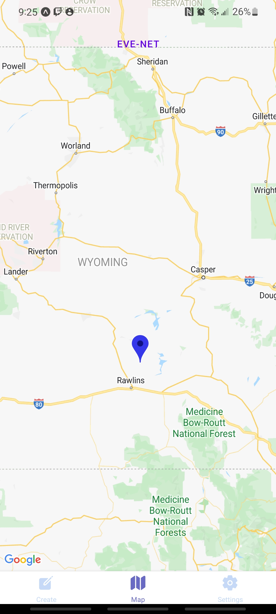
    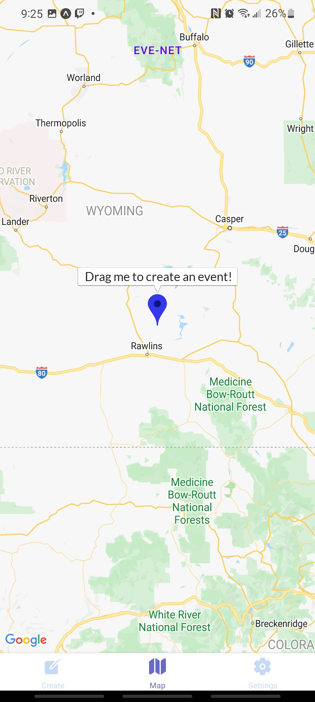
    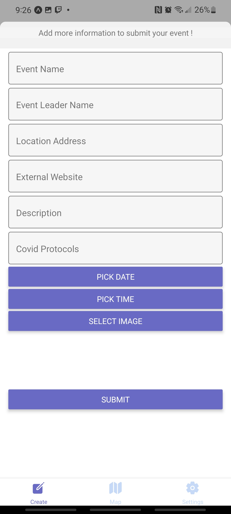
    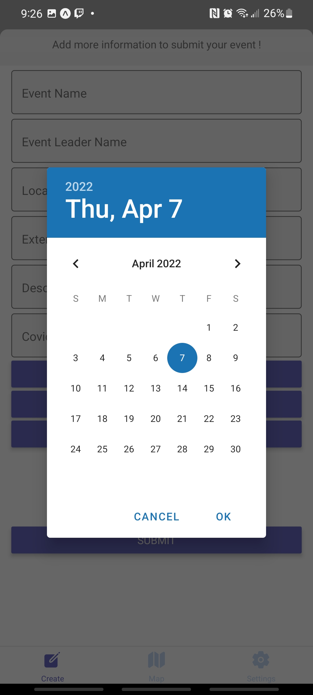
    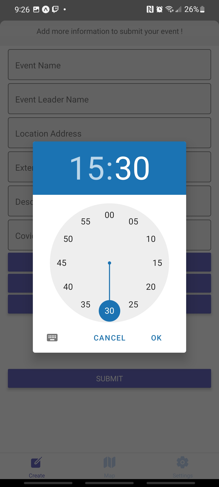
    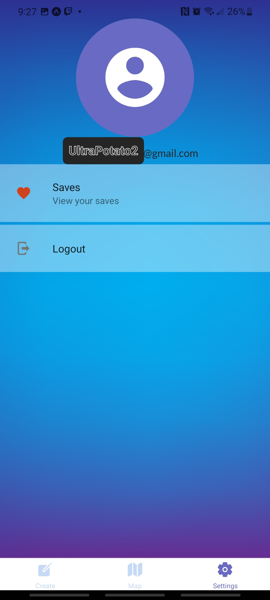
    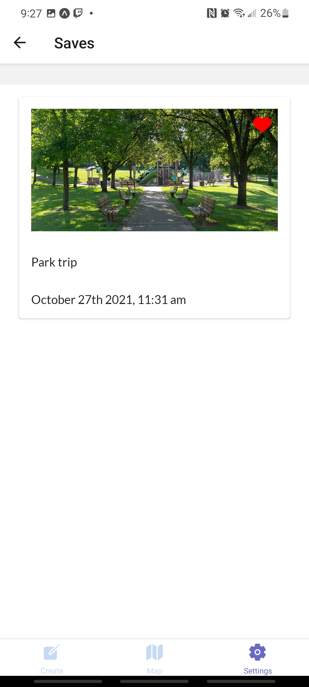
    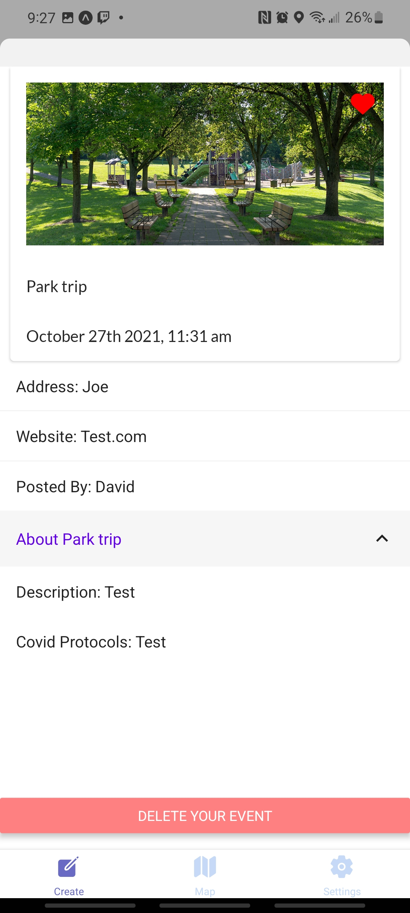
    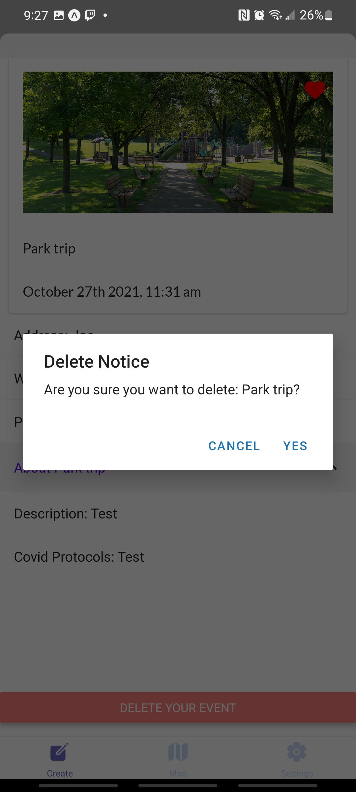
    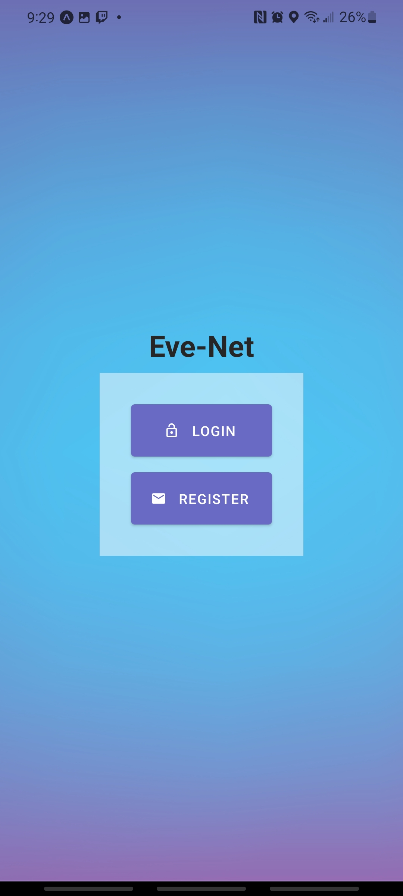
    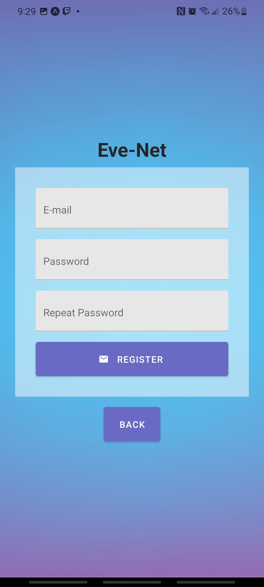
    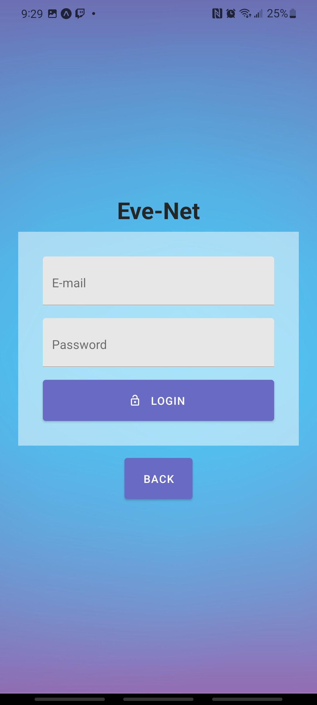

## :memo: License 

- This project is under the terms of the MIT license. For more information, please refer to the license [documentation](LICENSE).

## :warning: Disclaimer

- The contents of these pages are provided as an information guide only. While every effort is made in preparing the material for publication, no responsibility is accepted by or on behalf of the owner(s) for any errors, omissions or misleading statements on these pages or any site to which these pages connect. Although every effort is made to ensure the reliability of listed sites this cannot be taken as an endorsement of these sites.

## Special Thanks to YumMeals

- Alot of the structure and user interface was inspired by their app [YumMeals](https://github.com/BernStrom/YumMeals)
